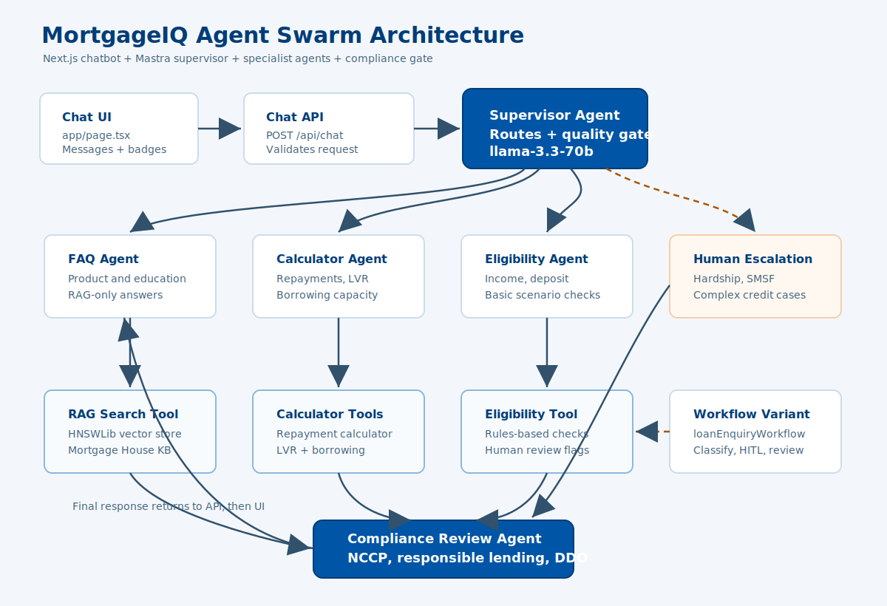

# MortgageIQ Agent Swarm Architecture

## System Summary

MortgageIQ Agent Swarm is a Next.js and Mastra-based mortgage assistant. The UI sends the latest user message to the chat API, which calls the supervisor agent. The supervisor routes the question to specialist agents, runs compliance review, and returns the final answer with tool metadata for the UI.

## Runtime Flow

1. User sends a message in the Next.js chatbot UI.
2. `POST /api/chat` validates the latest user message.
3. `supervisorAgent` classifies the intent and delegates work through Mastra tools.
4. Specialist agents handle product FAQ, calculations, eligibility, or human escalation.
5. The compliance agent reviews final answer text before user delivery.
6. The API returns plain text plus `__META__` tool-call metadata for UI badges.

## Main Components

| Component | File | Responsibility |
|---|---|---|
| Chat UI | `app/page.tsx` | Collects messages, streams assistant output, shows agent badges and toast errors. |
| Chat API | `app/api/chat/route.ts` | Validates input, calls supervisor, returns response metadata. |
| Supervisor agent | `src/agents/supervisor.ts` | Routes user questions to specialist tools and enforces final compliance review. |
| FAQ agent | `src/agents/specialists.ts` | Answers Mortgage House product and education questions using RAG only. |
| Calculator agent | `src/agents/specialists.ts` | Handles repayments, LVR, and borrowing capacity calculations. |
| Eligibility agent | `src/agents/specialists.ts` | Checks basic loan eligibility scenarios. |
| Compliance agent | `src/agents/specialists.ts` | Reviews responses for compliant financial guidance. |
| RAG tool | `src/tools/rag.ts` | Loads the local HNSWLib knowledge base and searches Mortgage House content. |
| Math tools | `src/tools/calculator.ts` | Provides repayment, LVR, and borrowing-capacity helpers. |
| Eligibility tool | `src/tools/eligibility.ts` | Applies basic scenario rules for eligibility checks. |

## Alternate Workflow

`src/workflows/loanEnquiry.ts` defines a workflow version of the same system with explicit intent classification, human-in-the-loop gating, specialist execution, and supervisor review. The current production API path uses `supervisorAgent` directly, while the workflow remains available for orchestration and experimentation.

## Operational Notes

- Product, policy, rate, and general home-loan education questions require the local Mortgage House knowledge base.
- Calculator and eligibility flows can run without the RAG knowledge base when the user provides enough numbers or scenario details.
- Human escalation is used for hardship, SMSF, non-resident, large loan, and complex credit scenarios.
- `npm run eval` exercises agent routing, but it depends on Groq API availability and token limits.
